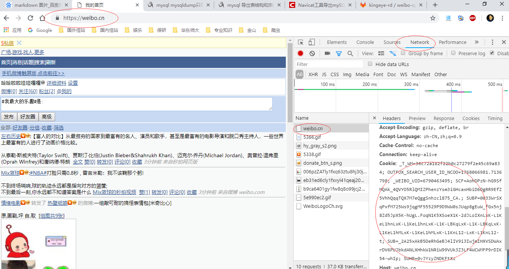
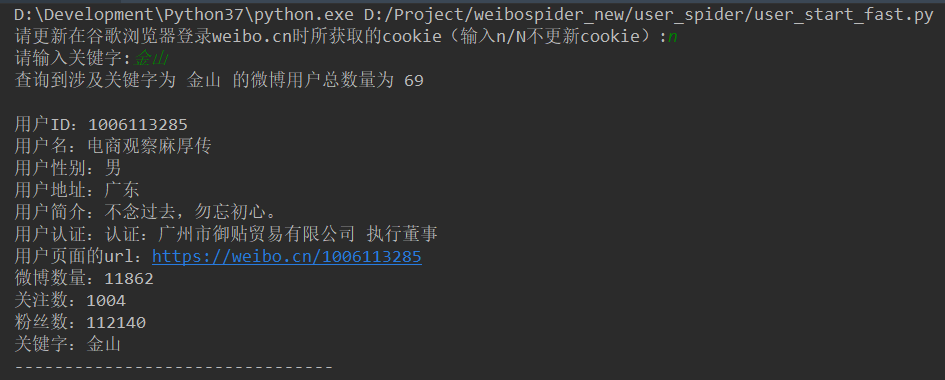
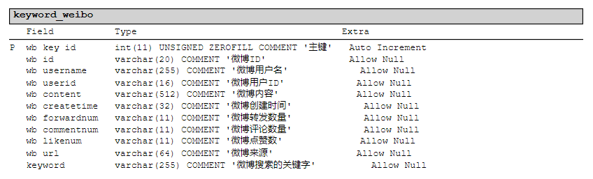
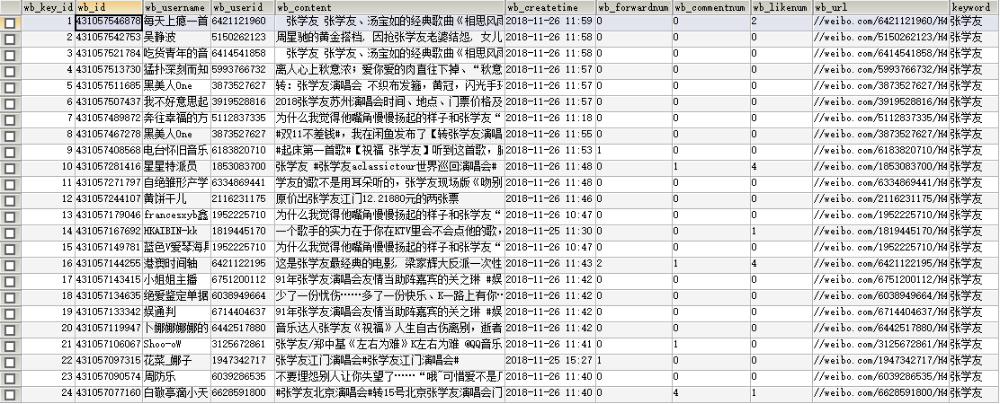
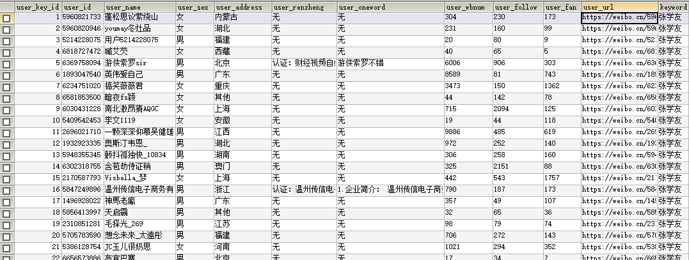
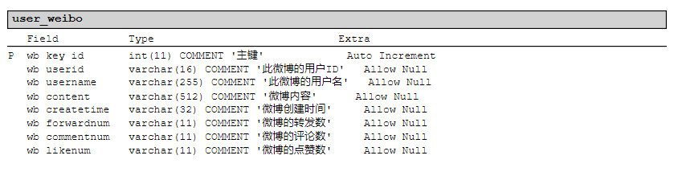
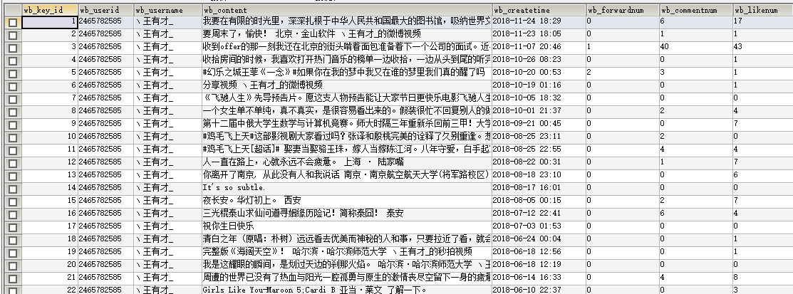

#:no_mouth:微博数据爬取项目   
制作人：王伟
## 一、项目总览
1、开发环境：
- python 3.6
- mysql 5.6
- 所需依赖：re datetime requests BeautifulSoup pymysql

2、现阶段已经实现了三个基本功能： 
- 根据搜索的关键字和起始时间条件搜索微博，对微博的信息进行爬取。 
- 获取(1)中通过关键字搜索出的各个微博的用户ID，并进行去重操作，爬取各个用户的基本信息。 
- 仅通过某个微博用户ID爬取此ID的全部微博内容。 

3、接口说明:  
① 根据关键字和时间条件进行搜索：https://s.weibo.com/weibo?q={}&typeall=1&suball=1&timescope=custom:{}:{}&Refer=g&page={}  

② 根据搜索出的每个微博对应的用户ID爬取用户基本信息：https://weibo.cn/{}

③ 仅根据某个用户ID爬取他的全部微博内容：https://weibo.cn/{}?page={}
 
 
## 二、项目结构介绍
search_spider           - 根据关键字和时间进行爬取的模块 - 
----hour_fenge.py       时间分隔函数：对要搜索的时间期限进行以每小时为单位的划分，返回包含所有时间单位的列表 
----search_start.py     根据关键字和时间条件进行爬取的主要函数：其中包括爬取某页全部微博、微博所有页数的计算、保存数据库等功能 

tools                   - 工具模块 - 
----Config.cfg          数据库等配置文件
----Cookie_Process.py   cookie处理函数：其中包括获取文件中存储的cookie、更新文件中存储的cookie等功能 
----Date_Process.py     时间处理函数：其中包括对爬取到微博的不同时间格式进行统一  
----Emoji_Process.py    表情处理函数：清除掉包含的utf8bm4编码格式的表情  
----Mysql_Process.py    mysql数据库工具类：其中包括数据库连接、关闭、增删改查的操作等 
----Number_Process.py   转发、评论数处理函数:对爬取到的微博的转发、评论数进行统一 

user_spider             - 爬取根据关键字搜索到的微博对应的微博用户的基本资料模块 - 
----cookie.file         存储可用的cookie信息 
----user_start.py       爬取用户资料的主要功能函数：包括获取所爬取微博的所有用户ID，并根据每个ID爬取其基本信息 

weibo_spider            - 根据某个用户ID爬取其所有微博的模块 - 
-----cookie.file        存储可用的cookie信息                 
-----weibo_start.py     爬取用户全部微博的主要功能函数：其中包括爬取某页全部微博、微博所有页数的计算、保存数据库等功能 
 
 
## 三、项目使用介绍
Ps：三个模块的功能相互独立，可直接运行 *_start.py 函数使用 

1、根据关键字和时间进行爬取的模块： 
- 此模块不需要登录，也不需要获取cookie，可直接运行search_start.py使用 
- 运行截图如下： 

2、爬取根据关键字搜索到的微博对应的微博用户的基本资料模块： 
- 此模块需要获取cookie，cookie存于目录下的cookie.file中， 
- 手动获取cookie的操作如下：必须使用谷歌浏览器，登录https://weibo.cn/，登陆成功后将网页地址统一成https://weibo.cn/，打开谷歌浏览器开发工具，选择network,点击weibo.cn，查看Request Headers中的Cookie
- 获取截图如下： 

- 直接运行user_start_fast即可使用，运行时会提示是否更新cookie，如不更新，输入n/N即可
- 运行截图如下： 

3、 根据某个用户ID爬取其所有微博的模块 
- 此模块需要获取cookie，cookie存于目录下的cookie.file中 
- 获取cookie操作同上
- 直接运行weibo_start.py即可使用，运行截图如下： 

 
 
## 四、数据库设计说明
1、keyword_weibo表：存储通过关键字和起止时间搜索出的微博信息 

2、keyword_userinfo表：存储通过关键字和起止时间搜索出的每个微博对应用户的基本资料 

3、user_weibo表：存储仅通过任意的用户ID搜索出的其所有微博信息 

  

  

